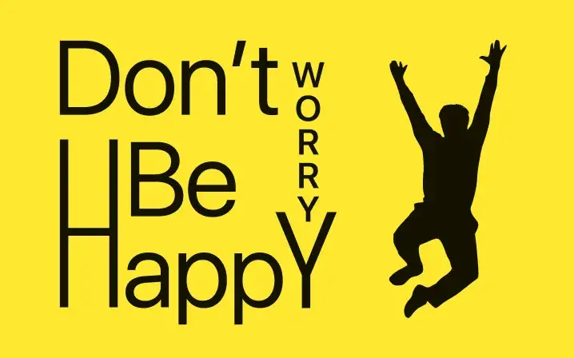
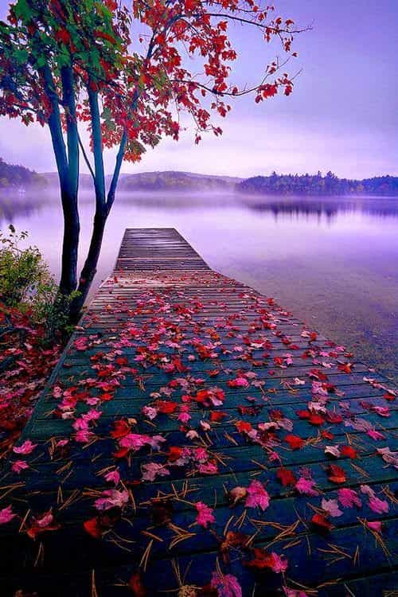
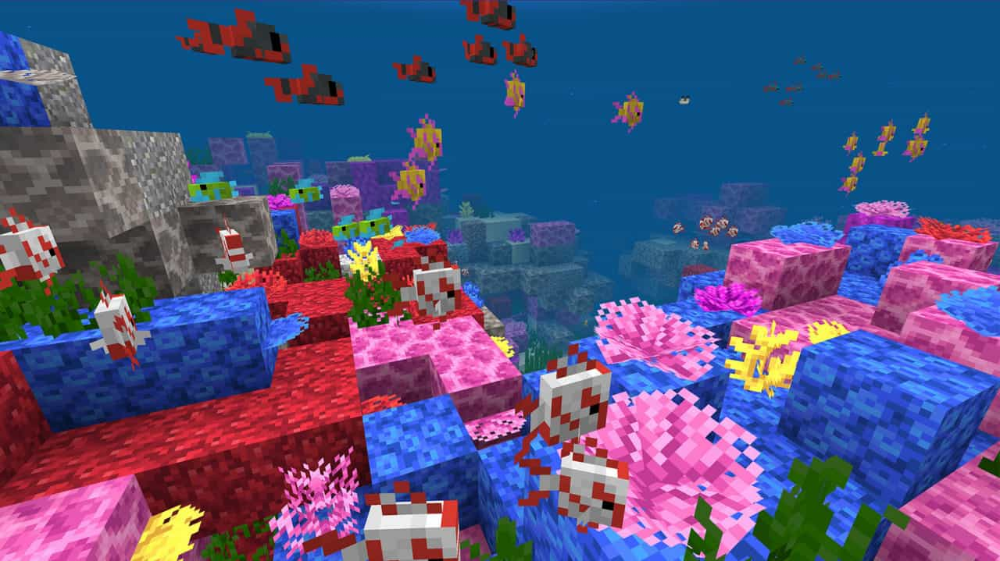
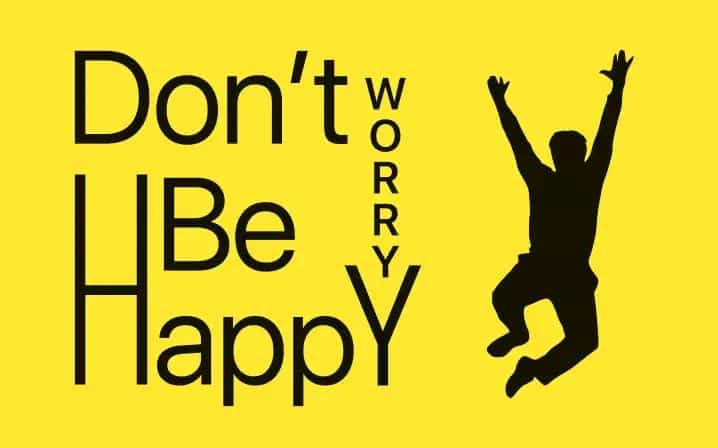
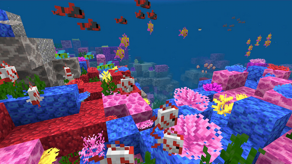

# Практичне заняття

## “Оптимізація зображень за допомогою [Squoosh]

## Виконав:  
**Мельцев Ростислав**  
**Група: ІПЗ-2.03**
### Мета заняття

1. Ознайомити студентів із методами стиснення зображень та їхнім впливом на якість.
2. Навчити визначати оптимальний баланс між якістю та розміром файлу.
3. Ознайомити студентів із різними типами стиснення: **без втрат (lossless)** та **з втратами (lossy)**.
4. Дослідити вплив зміни розміру на якість зображення та вагу файлу.
5. Навчитися адаптувати зображення для різних цільових застосувань:
   - Веб (оптимізація для швидкого завантаження).
   - Мобільні пристрої (зменшені розміри, ефективне стиснення).
   - Retina-дисплеї (2x, 3x версії для збереження якості).
6. Закріпити навички документування та аналізу результатів у Markdown-форматі у **GitHub-репозиторії**.

## Початкові зображення
|    | Вага             | Формат|  Розмір|
|-----|------------------------|------------------------|------------------------|
| Фото | 107 КБ                 |   jpg                |        500x750          |
| Скриншот | 288 КБ               |   jpg                |        1280x719         |
| З-текстом | 123 КБ               |   png                |        718x448          |

## Таблиця порівняння

### 1. Оригінальні зображення
|    | Фото | Скриншот | З-текстом |
|-----|------------------------|------------------------|------------------------|
| вага | 107 КБ                 | 288 КБ                 | 123 КБ                 |
| формат | jpg                    | jpg                    | png                    |
| розмір | 500x750                | 1280x719               | 718x448                |

  

### 2. Lossless формати

#### 2.1 PNG
|    | Фото | Скриншот | З-текстом |
|-----|------------------------|------------------------|------------------------|
| вага | 885 кБ                 | 1.57 МБ                | 189 кБ                 |
| формат | png                    | png                    | png                    |
| розмір | 500x750                | 1280x719               | 718x448                |

###  PNG
  

#### 2.2 WebP (без втрат)
|    | Фото | Скриншот | З-текстом |
|-----|------------------------|------------------------|------------------------|
| вага | 543 кБ                 | 1.03 МБ                | 103 кБ                 |
| формат | WebP                   | WebP                   | WebP                   |
| розмір | 500x750                | 1280x719               | 718x448                |

### WebP (без втрат)
  

### 3. Lossy формати

#### 3.1 MozJPEG

##### 3.1.1 MozJPEG (100%)
|    | Фото | Скриншот | З-текстом |
|-----|------------------------|------------------------|------------------------|
| вага | 391 кБ                 | 78.3 кБ                | 16.6 кБ                |
| формат | MozJPEG                | MozJPEG                | MozJPEG                |
| розмір | 500x750                | 1280x719               | 718x448                |

### MozJPEG (100%)
  

##### 3.1.2 MozJPEG (75%)
|    | Фото | Скриншот | З-текстом |
|-----|------------------------|------------------------|------------------------|
| вага | 84.6 кБ                | 120 кБ                 | 23.1 кБ                |
| формат | MozJPEG                | MozJPEG                | MozJPEG                |
| розмір | 500x750                | 1280x719               | 718x448                |

### MozJPEG (75%)
  

##### 3.1.3 MozJPEG (50%)
|    | Фото | Скриншот | З-текстом |
|-----|------------------------|------------------------|------------------------|
| вага | 53.4 кБ                | 491 кБ                 | 123 кБ                 |
| формат | MozJPEG                | MozJPEG                | MozJPEG                |
| розмір | 500x750                | 1280x719               | 718x448                |

### MozJPEG (50%)
  

#### 3.2 WebP (з втратами)

##### 3.2.1 WebP (100%)
|    | Фото | Скриншот | З-текстом |
|-----|------------------------|------------------------|------------------------|
| вага | 69.0 кБ                | 72.4 кБ                | 11.6 кБ                |
| формат | WebP (lossy)           | WebP (lossy)           | WebP (lossy)           |
| розмір | 500x750                | 1280x719               | 718x448                |

### WebP (100%)
/Photo100.webp) /Screenshot100.webp) /Text100.webp)

##### 3.2.2 WebP (75%)
|    | Фото | Скриншот | З-текстом |
|-----|------------------------|------------------------|------------------------|
| вага | 88.9 кБ                | 96.9 кБ                | 13.6 кБ                |
| формат | WebP (lossy)           | WebP (lossy)           | WebP (lossy)           |
| розмір | 500x750                | 1280x719               | 718x448                |

### WebP (75%)
/Photo75.webp) /Screenshot75.webp) /Text75.webp)

##### 3.2.3 WebP (50%)
|    | Фото | Скриншот | З-текстом |
|-----|------------------------|------------------------|------------------------|
| вага | 226 кБ                 | 330 кБ                 | 31.6 кБ                |
| формат | WebP (lossy)           | WebP (lossy)           | WebP (lossy)           |
| розмір | 500x750                | 1280x719               | 718x448                |

### WebP (50%)
/Photo50.webp) /Screenshot50.webp) /Text50.webp)

#### 3.3 AVIF

##### 3.3.1 AVIF (100%)
|    | Фото | Скриншот | З-текстом |
|-----|------------------------|------------------------|------------------------|
| вага | 70.7 кБ                | 68.0 кБ                | 7.80 кБ                |
| формат | AVIF                   | AVIF                   | AVIF                   |
| розмір | 500x750                | 1280x719               | 718x448                |

### AVIF (100%)
  

##### 3.3.2 AVIF (75%)
|    | Фото | Скриншот | З-текстом |
|-----|------------------------|------------------------|------------------------|
| вага | 109 кБ                 | 140 кБ                 | 15.2 кБ                |
| формат | AVIF                   | AVIF                   | AVIF                   |
| розмір | 500x750                | 1280x719               | 718x448                |

### AVIF (75%)
  

##### 3.3.3 AVIF (50%)
|    | Фото | Скриншот | З-текстом |
|-----|------------------------|------------------------|------------------------|
| вага | 236 кБ                 | 309 кБ                 | 41.6 кБ                |
| формат | AVIF                   | AVIF                   | AVIF                   |
| розмір | 500x750                | 1280x719               | 718x448                |

### AVIF (50%)
  

### 4. Оптимізація розміру

#### 4.1 Для вебу
|    | Фото | Скриншот | З-текстом |
|-----|------------------------|------------------------|------------------------|
| вага | 2.02 МБ                | 132 кБ                 | 298 кБ                 |

  

#### 4.2 Для мобільних
|    | Фото | Скриншот | З-текстом |
|-----|------------------------|------------------------|------------------------|
| вага | 720 кБ                 | 351 кБ                 | 115 кБ                 |

  

#### 4.3 Для Retina-дисплеїв
|    | Фото | Скриншот | З-текстом |
|-----|------------------------|------------------------|------------------------|
| вага | 2.81 МБ                | 644 кБ                 | 653 кБ                 |

  

## Висновки

- **Який формат найкраще підходить для якого типу зображень**  
  - **PNG** – для прозорих зображень, ілюстрацій та графіки з різкими краями.  
  - **WebP** – для веб-графіки та фотографій із гарним стисненням і підтримкою прозорості.  
  - **MozJPEG** – оптимізована версія JPEG, яка зменшує вагу файлу без значних втрат якості.  
  - **AVIF** – найефективніший формат для збереження якості при мінімальному розмірі, але з обмеженою підтримкою.  
  - **JPG (JPEG)** – стандартний формат для фотографій із гарним стисненням, але без підтримки прозорості.  

- **Як зміна розміру впливає на оптимізацію**  
  - Зменшення розміру файлу прискорює завантаження сайту та покращує продуктивність.  
  - Важливо вибирати оптимальний баланс між якістю та розміром файлу.  

- **Як правильно адаптувати зображення для Retina-дисплеїв**  
  - Використовувати зображення з роздільною здатністю, що вдвічі перевищує фізичний розмір.  
  - Формати WebP та AVIF допомагають зменшити вагу великих зображень без втрати якості.  
