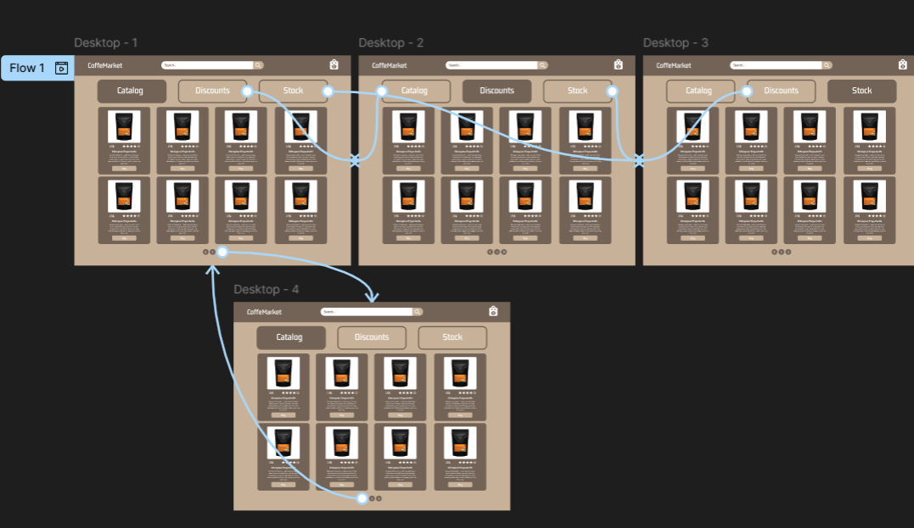

# Практична №10 Використання інструментів прототипування

## Виконав:  
**Мельцев Ростислав**  
**Група: ІПЗ-2.03**  

## Завдання:
1. Cтворити у Figma  деталізований  вайрфрейм   сайту для інтернет-магазину. 
2. Використати інструменти прототипування і зробити клікабельний прототип на основі вайфрейму.
3. Написати звіт

---
## Результати:  

Посилання на проект: [workshop_10](https://www.figma.com/design/138qA0cYf1BYJHqAdRjfFp/Untitled?node-id=11-2&t=5G9GfDn9sORfuU3v-1)
