# Практична №11 Дослідження кольорових гармоній та інструментів аналізу кольору в [Adobe Color](https://color.adobe.com/)

## Виконав:  
**Мельцев Ростислав**  
**Група: ІПЗ-2.03**  

## Завдання:
1. Ознайомитися з поняттям кольорової гармонії, типами гармоній та колірними моделями
2. Створити палітри за різними принципами гармонії за допомогою Adobe Color
3. Згенерувати палітри зображень (Extract Theme) та градієнт (Extract Gradient)
4. Перевірити контрастність кольорових пар відповідно до стандартів доступності (WCAG)
5. Написати звіт

---
## Хід роботи:
1. Теоретична частина
    - Кольорова гармонія — це поєднання кольорів, яке викликає візуальну рівновагу та естетичне задоволення. Гармонія кольорів необхідна в дизайні для створення зрозумілих, зручних та привабливих інтерфейсів.
    - Типи гармоній:
        - Analogous — схожі кольори поруч на колі
        - Monochromatic — один колір у різній насиченості
        - Triad — три кольори, рівновіддалені на колі
        - Complementary — протилежні кольори
        - Split Complementary — два сусідніх до комплементарного
        - Square — чотири рівновіддалені кольори
        - Custom — побудова за власним вибором
    - Колірні моделі:
        - RGB — для цифрових екранів
        - HSB — відтінок, насиченість, яскравість
        - LAB — математична модель для точного порівняння
    - Контрастність і WCAG — Стандарти WCAG 2.1 встановлюють рівні доступності (AA, AAA) для тексту щодо фону. Контраст забезпечує читабельність для всіх користувачів
2. Практична частина
    - Color Wheel:
        - Створено палітри для кожного типу гармонії
        - Для кожної палітри зазначено базовий колір, зроблено скріншоти та додано короткий опис логіки побудови та передбачуваного емоційного ефекту  
            | Тип гармонії | Базовий колір | Скріншот | Логіка побудови і передбачуваний емоційний ефект |
            |--------------|---------------|----------|--------------------------------------------------|
            | Analogous | #FAA7E8 | 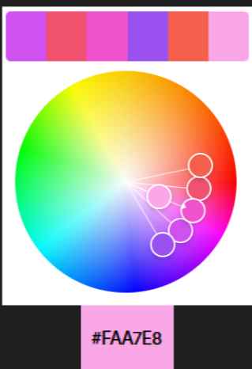 | Побудована на суміжних тонах одного сектора колірного кола — від холодного пурпуру до теплого коралу. Завдяки поступовому градієнту палітра виглядає м’яко й природно, не перевантажує зір. |
            | Monochromatic | #F01800 | 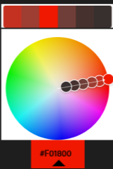 | Варіації червоного з різною яскравістю та насиченістю — виглядає гармонійно й спокійно. |
            | Triad | #01F025 | 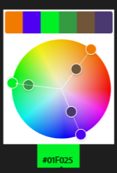 | Використано три рівновіддалені кольори на колі — яскрава й динамічна триадна схема. Один колір домінує , два інші  виступають контрастними акцентами. Навіть із приглушеними тонами палітра залишається збалансованою та енергійною.|
            | Complementary | #EBD93D | 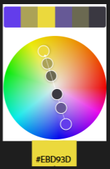 | Контрастна пара — побудована на протилежних кольорах кола: жовтий і фіолетовий. Така схема створює сильний візуальний контраст, виглядає виразно та динамічно. Ідеально підходить для акцентів, кнопок або виділення важливих елементів. |
            | Split Complementary | #EB7B22 | 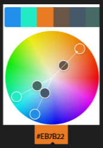 | Менш агресивна версія комплементарної схеми — базовий помаранчевий  та два кольори, розташовані поруч із його протилежним. Зберігається контраст, але палітра виглядає м’якіше й гармонійніше. Добре підходить для акцентів, не перенавантажуючи дизайн. |
            | Square | #17B5EB | 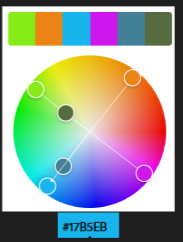 | Чотири кольори на однаковій відстані на колі — яскрава, динамічна палітра з насиченим контрастом. Щоб зберегти баланс, варто обрати один головний колір, а інші використовувати як акценти або для розстановки настрою.|
            | Custom | #01EBC8 | 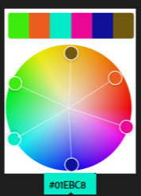 | Побудована інтуїтивно, за смаком дизайнера |
    - Extract Theme:
        - Завантажено зображення в розділ Extract Theme  
            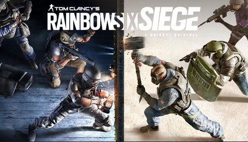
        - Створено дві палітри: Colorful та Muted  
            | Тип | Скріншот | Коментар |
            |-----|----------|----------|
            | Colorful | 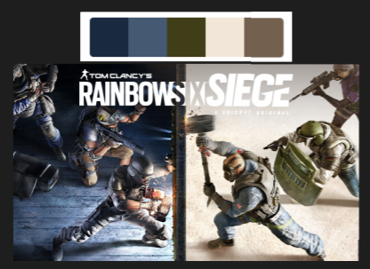 | Стримана, контрастна палітра з домінуванням холодних синіх та зелених відтінків у поєднанні з теплими нейтральними — створює напружену, тактичну атмосферу. Виглядає серйозно та функціонально, підкреслює динаміку й конфлікт. |
            | Muted | 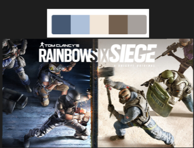 | Більш спокійна та гармонійна палітра — холодні блакитні й теплі пісочні відтінки врівноважені між собою. Менше агресії, більше ясності й простору; створює відчуття професійності та зосередженості.|  

            **Висновок:** Muted-палітра краще підходить для UI — вона спокійна, не перевантажує зір, не відволікає увагу користувача. Приглушені кольори виглядають приємно, професійно й забезпечують комфортну взаємодію з інтерфейсом.
    - Extract Gradient:
        - Завантажено те саме зображення в розділ Extract Gradient  
            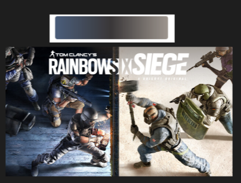
        - Створено градієнт з трьома кольоровими точками (Gradient Stops = 3)
    - Accessibility Tools:
        - Вибрана палітра Monochromatic
        - Кольори #FAA7E8 та #8A8DFF для тексту та заднього фону відповідно  
            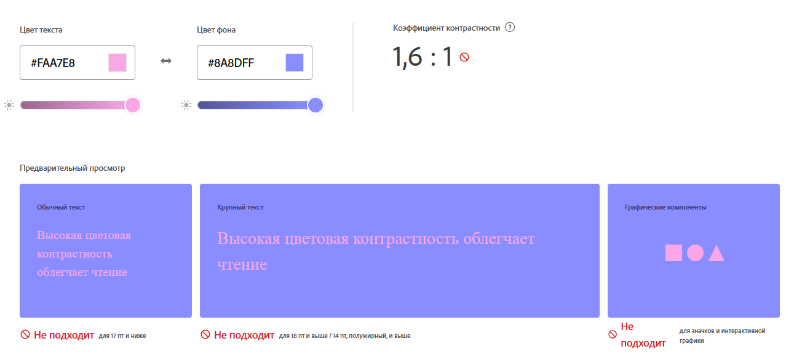  
            **Висновок:** вибір кольорів не відповідає стандарту коефіцієнта контрастності; 1,6:1 - дуже мало
        - Використано запропоновану корекцію, що змінило колір тексту  
            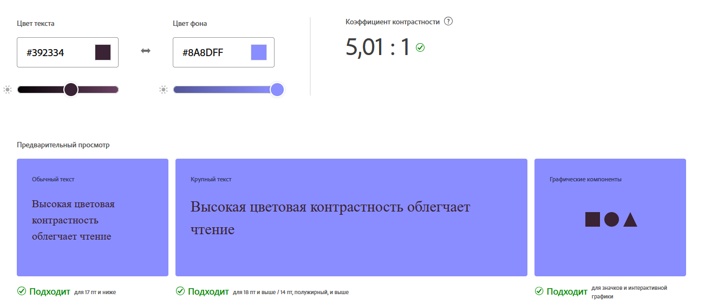  
4. Висновки
**Найзручніші для інтерфейсів** — найкраще підходять палітри Monochromatic, Analogous, Muted і варіанти з високим контрастом — вони не перевантажують зір і забезпечують візуальний комфорт.Щоб інтерфейс залишався доступним, обов’язково перевіряйте поєднання кольорів на контрастність відповідно до стандартів WCAG.Adobe Color — корисний інструмент для створення кольорових схем, градієнтів і перевірки їхньої доступності.