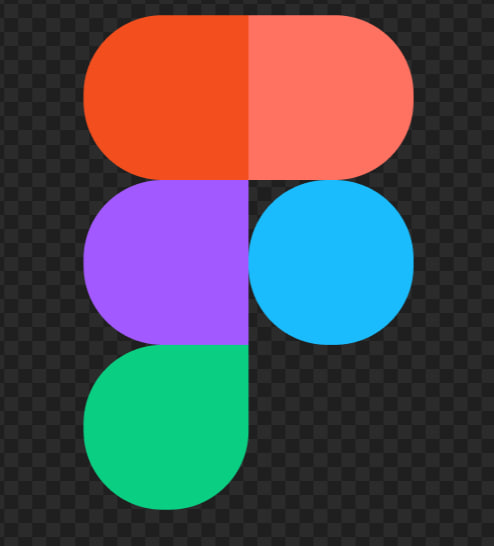
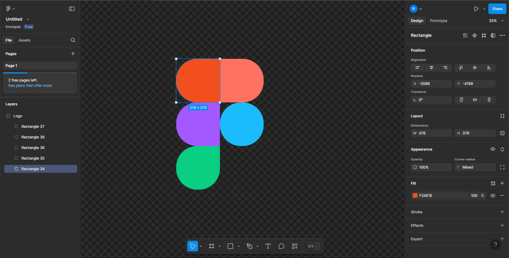

# Практична №2 - Робота з простими формами та їх властивостями

## Виконав:  
**Мельцев Ростислав**  
**Група: ІПЗ-2.03**  

## Завдання:
1. Переглянути матеріал лекції
2. Повторити дизайн логотипу Фігми
3. Написати звіт

## Результати

 

 Посилання на проект: [workshop_2](https://www.figma.com/design/138qA0cYf1BYJHqAdRjfFp/Untitled?node-id=0-1&t=ziQL0nOA4rb7i3qb-1)
