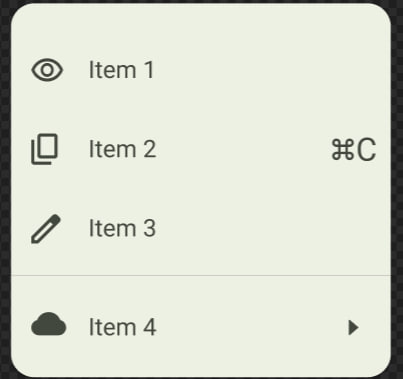

# ПЗ-4 Завдання для самостійного опрацювання

## Виконав:  
**Мельцев Ростислав**  
**Група: ІПЗ-2.03**  

## Завдання:
1. Розглянути завдання **Basic** із прикріпленого документа
2. Повторити у фігмі “один в один” елемент дизайну представленний у файлі
3. Написати звіт

---

## Хід роботи:
1. Аналіз
    - Основа меню - закруглений квадрат
    - Меню складаєтся з 4 елементів
    - Підменю складається з іконок та тексту
    
2. Розробка
    - Підготовка матеріалів
    - Додавання тіні до основи
    - Розташування іконок та тексту відповідно до референсу
3. Результати
      

    Посилання на проект: [workshop_3](https://www.figma.com/design/0AJa4x3C8MY1dDswO5pEeT/Untitled?node-id=0-1&t=RKlKTCW77yMeXaik-1)

## Користні матеріали:
**Плагіни Figma:**   
Feather Icons,  iconsax 6000+  – імпорт значків (іконок)  

**Посилання:**  
https://fonts.google.com/icons  
https://www.flaticon.com  
https://iconarchive.com  
https://www.iconfinder.com/free_icons  
https://iconmonstr.com  
https://www.vecteezy.com/free-vector/icons  
https://www.youtube.com/watch?v=VqQeUNmXvwU  
https://www.komarov.design/nova-funktsiia-sections-u-figma-shcho-tsie-i-iak-vikoristovuvati/?authuser=0

## Використані матеріали:  
Іконки взяти готові з https://fonts.google.com/icons  
Шрифт Roboto взяти з Google Fonts
