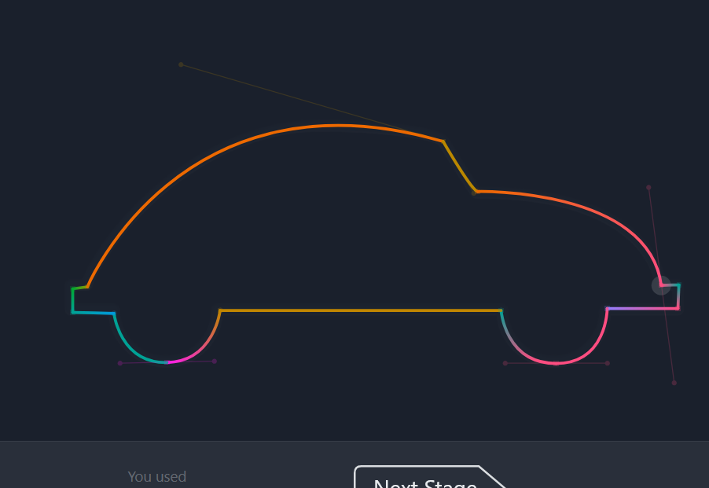

# Практична №4 - Робота з пером та вектором

## Виконав:  
**Мельцев Ростислав**  
**Група: ІПЗ-2.03**  
[Посилання на проект в Фігма](https://www.figma.com/design/0AJa4x3C8MY1dDswO5pEeT/Untitled?node-id=0-1&t=TIb4q5z2A1gQINP4-1)

## Завдання:
1. Переглянути матеріал лекції
2. Потренуватися з Pen Tool на сайті [The Bezier Game](https://bezier.method.ac/?authuser=0)
3. Створити  п'ять іконок за вибором у border стилі
4. Написати звіт

---

## Хід роботи:
1. Аналіз
    - Іконки мають прості геометричні форми з чіткими лініямиі
    - Розмір іконок стандартний – 24×24 px
    - Усі іконки складаються з базових геометричних фігур та кривих Безьє
2. Розробка
    - Підготовка матеріалів:
        - Вивчення роботи Pen Tool у Figma
        - Проходження The Bezier Game для практики  
            
    - Створення іконок:
        - Використання Pen Tool та базових фігур
        - Робота з кривими Безьє для плавних ліній
        - Вирівнювання елементів у межах 24×24 px
        - Використання border-style
3. Результати  
    

    Посилання на проект: [workshop_4](https://www.figma.com/design/0AJa4x3C8MY1dDswO5pEeT/Untitled?node-id=0-1&t=TIb4q5z2A1gQINP4-1)
