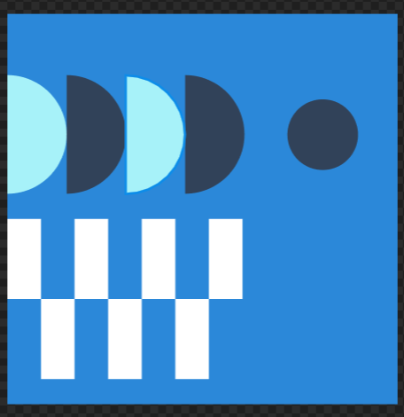
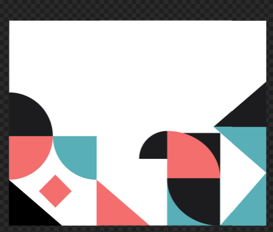
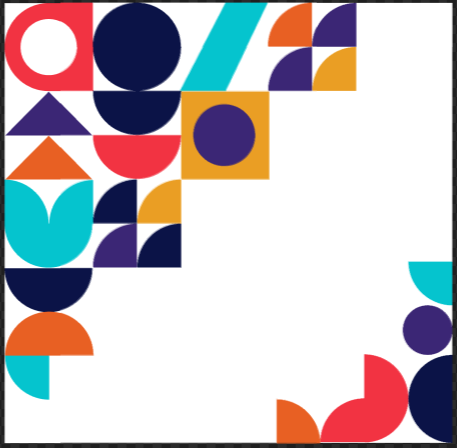

# ПЗ-3 Робота з простими формами та їх властивостями у Figma. Створення геометричного візерунку

## Виконав:  
**Мельцев Ростислав**  
**Група: ІПЗ-2.03**  

## Завдання:
1. Переглянути матеріал лекції
2. Використовуючи прості фігури та їх властивості сервісу Figma, створити фрагмент [геометричного візерунку](https://www.figma.com/file/3fUhVxZnRrlhGqkdTR9RT8/20-Patterns-%28Community%29?type=design&node-id=101-60&mode=design&t=BCJ2ZrG3S10L98hk-0&authuser=0)
3. Написати звіт

---

## Хід роботи:
1. Аналіз
    - Ознайомлення з матеріалами розділу 8 керівництва користувача Figma
    - Вивчення концепцій, що можуть бути корисні у розробці дизайну
    - Аналіз композиції геометричних візерунків: використання простих форм, повторюваність елементів, пропорційність
2. Розробка
    - Визначення базових елементів, що використовуватимуться у шаблоні
    - Використання простих геометричних фігур (кола, трикутники, прямокутники) для побудови узору
    - Розташування елементів відповідно до сітки
    - Використання принципів пропорційності та симетрії для гармонійного вигляду візерунку
    - Додавання кольорових схем відповідно до референсів
3. Результати  
    
    
    

    Посилання на проект: [workshop_7](https://www.figma.com/design/0AJa4x3C8MY1dDswO5pEeT/Untitled?node-id=0-1&t=axYMhNRvdYRUoUOu-1)