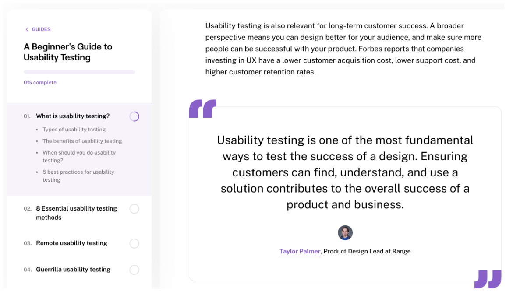
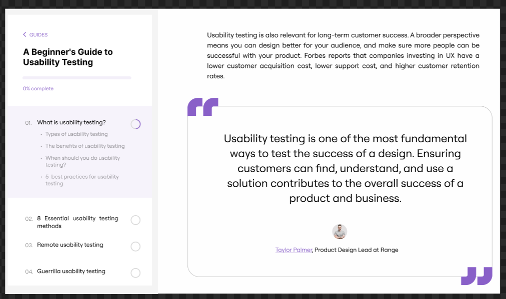

# Практична №8 Робота з макетами - Завдання для самостійного опрацювання

## Виконав:  
**Мельцев Ростислав**  
**Група: ІПЗ-2.03**  

## Завдання:
1. Переглянути відео: [YouTube: Текст та як із ним працювати](https://www.youtube.com/watch?v=VouVsut_-Ak&authuser=0)
2. Виконати завдання із прикріпленного файлу
3. Написати звіт

---
## Результати:  

Посилання на проект: [workshop_8](https://www.figma.com/design/138qA0cYf1BYJHqAdRjfFp/Untitled?node-id=1-209&t=ziQL0nOA4rb7i3qb-1)
