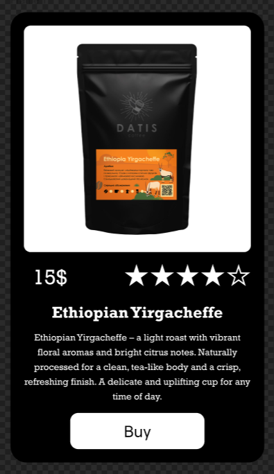

# Практична №9 Створення картки товару з використанням Auto Layout

## Виконав:  
**Мельцев Ростислав**  
**Група: ІПЗ-2.03**  

## Завдання:
1. Створити малу картку товару, використовуючи функцію Auto layout у Figma
2. При оформленні використати відповідне зображення, текст, значки
3. Написати звіт

---
## Результати:  

Посилання на проект: [workshop_9](https://www.figma.com/design/138qA0cYf1BYJHqAdRjfFp/Untitled?node-id=1-248&t=ziQL0nOA4rb7i3qb-1)
